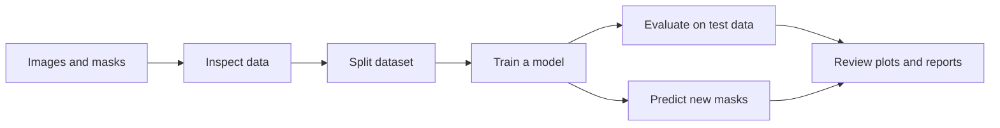

# bicbioseg

Prepare biomedical image datasets, train segmentation models, and predict masks with a Python API.
Use one workflow to inspect data, compare models, and save results.

This library is in early development. APIs can change between releases.

## Install

Use Python 3.11 or later.

```bash
pip install bicbioseg
```

Install optional features when you need them:

| Feature | Command |
| --- | --- |
| DeiT, Swin, and PVTv2 models | `pip install 'bicbioseg[transformers]'` |
| DICOM conversion | `pip install 'bicbioseg[dicom]'` |
| Albumentations transforms | `pip install 'bicbioseg[albumentations]'` |

TransUNet, including its ResNet-50 encoder, works with the base installation.

## Follow the workflow



Match each image with a mask that has the same filename stem.
Use grayscale or RGB images. Use two-dimensional masks with integer labels.

```text
raw/
  images/
    sample_001.png
    sample_002.png
  masks/
    sample_001.png
    sample_002.png
```

For binary segmentation, use 0 for background and positive values for foreground.
For multiclass segmentation, use class IDs from 0 through `num_classes - 1`.
See [dataset preparation](docs/data.md) for grouping, patches, and color-mask conversion.

## Train your first model

This example trains a binary U-Net and saves the workflow outputs in `cell_experiment`.
Use your own paired dataset and a folder of new images.

```python
from bicbioseg import SegmentationExperiment, set_seed

set_seed(42)

exp = SegmentationExperiment(
    images="raw/images",
    masks="raw/masks",
    model="unet",
    loss="dice",
    work_dir="cell_experiment",
    image_size=(224, 224),
)

exp.qc()
exp.preview(show=True)
exp.prepare(split=(0.8, 0.1, 0.1), resize=(224, 224))
exp.train(epochs=50, batch_size=8, num_workers=0, early_stopping=True, patience=10)
exp.evaluate()
exp.predict("new_images", save_overlay=True)
exp.report()
```

Review the quality report and preview before training.
The workflow saves split data, checkpoints, training history, predictions, evaluation scores, and a report.
`evaluate` and `predict` use the model currently in memory. See [training](docs/training.md) to load the best saved checkpoint.

## Use the components you need

| Component | Use it to |
| --- | --- |
| `SegmentationExperiment` | Run preparation, training, evaluation, and prediction in one workspace. |
| `ImageOps` | Inspect datasets, convert images, process masks, and measure objects. |
| `Segmenter` | Train and use a model with prepared data or custom loaders. |
| Models | Choose a CNN, transformer, or hybrid encoder and a segmentation decoder. |
| `DataLoader` and augmentation | Create paired image/mask batches and transforms. |
| Configuration objects | Save reusable model, dataset, training, and experiment settings. |

See the [component diagram and user guide](docs/README.md).

## Choose a model

The library provides 12 architectures. Each link lists its variants, defaults, input requirements, and configuration example.

| Model | Main choices |
| --- | --- |
| [U-Net](docs/models/unet.md) | Width, depth, and upsampling method |
| [CAttention U-Net](docs/models/cattention_unet.md) | U-Net with decoder channel and spatial attention |
| [DoubleUNet](docs/models/double_unet.md) | VGG19, ResNet-50, or ResNet-101 first encoder. RGB binary masks only. |
| [TransUNet](docs/models/transunet.md) | Custom CNN or ResNet-50, with lightweight, standard, and heavy transformer configurations |
| [SegFormer](docs/models/segformer.md) | Four configurable Mix Transformer stages |
| [DeiT](docs/models/deit.md) | tiny, small, or base, with optional distilled encoder |
| [Swin with convolutional decoder](docs/models/swin_unet.md) | tiny, small, or base |
| [PVTv2 with convolutional decoder](docs/models/pvt_unet.md) | b0 through b5 |
| [Full Swin-Unet](docs/models/swin_unet_full.md) | tiny, small, or base, with configurable Swin decoder depth |
| [PVTFormer](docs/models/pvtformer_full.md) | b0 through b5, with residual decoding and multiscale fusion |
| [ResUNet++](docs/models/resunetplusplus_full.md) | Residual blocks, attention, and configurable ASPP |
| [UNeXt](docs/models/unext_full.md) | base, small, or custom stage widths |

DeiT, Swin, and PVTv2 are separate architecture choices. Select them through `model` or `architecture`.
See [model selection](docs/models/README.md) for shared behavior and setup checks.

## Predict with a saved model

```python
from bicbioseg import Segmenter

model = Segmenter.load("cell_experiment/runs/unet_dice/best_model.pt")
model.inference("new_images", save_to="predictions", save_overlay=True)
```

See [inference](docs/inference.md) for single images, tiled prediction, and ensembles.

## Continue with your task

- [Prepare and inspect data](docs/data.md)
- [Train, save, and resume](docs/training.md)
- [Evaluate predictions and inspect failures](docs/evaluation.md)
- [Compare experiments](docs/experiments.md)
- [Find every configuration field](docs/configuration/README.md)
- [Read acknowledgments](docs/references.md)

The project uses the [MIT license](LICENSE).
