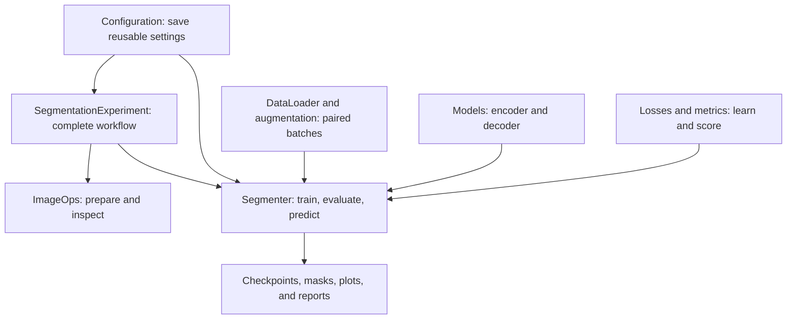

# User guide

[Main README](../README.md)

Follow the workflow or open the reference for the setting you need.

| Task | Guide |
| --- | --- |
| Prepare pairs, splits, groups, and patches | [Dataset preparation](data.md) |
| Inspect data, convert formats, and measure objects | [Image operations](image-operations.md) |
| Choose an architecture and variant | [All 12 models](models/README.md) |
| Train, save, and resume | [Training](training.md) |
| Apply paired transforms | [Augmentation](augmentation.md) |
| Predict one image, a folder, or a large image | [Inference](inference.md) |
| Score predictions and inspect failures | [Evaluation](evaluation.md) |
| Compare model and loss combinations | [Experiments](experiments.md) |
| Find defaults and accepted values | [Configuration reference](configuration/README.md) |
| Find implementation references | [Acknowledgments](references.md) |

## Library components

Use `SegmentationExperiment` to connect the common steps.
Use `Segmenter` when you already have split data or custom loaders.
Use `ImageOps` without a model for preparation and inspection.
Use the model classes directly when you need a custom PyTorch loop.
