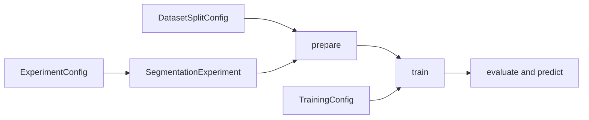

# Complete workflow settings

[All configuration](README.md) · [Main guide](../../README.md)

## ExperimentConfig

Use this configuration to set the raw data, model, and output directory.

```python
from bicbioseg import ExperimentConfig, SegmentationExperiment

config = ExperimentConfig(
    images="raw/images",
    masks="raw/masks",
    model="unet",
    work_dir="cell_experiment",
)
config.save("cell_experiment.json")
exp = SegmentationExperiment.from_config("cell_experiment.json")
```

## All fields

| Option | Default | Purpose and accepted values |
| --- | --- | --- |
| `images` | `required` | Required image folder, path list, or supported path-list file. |
| `masks` | `required` | Required masks with matching image filename stems. |
| `model` | `'unet'` | Registered model name or alias. This is the experiment equivalent of `architecture`. |
| `loss` | `'dice'` | Loss name. See [loss choices](losses.md). |
| `work_dir` | `'bicbioseg_experiment'` | Parent directory for the prepared dataset, QC, run artifacts, evaluation, and predictions. |
| `image_size` | `(224, 224)` | Model input size as `(height, width)`. The loader resizes each image and mask to this size. |
| `num_classes` | `1` | Use 1 for binary segmentation. Use at least 2 for multiclass segmentation. |
| `in_channels` | `3` | Input channel count. File workflows support 1 for grayscale or 3 for RGB. |
| `metrics` | `None` | Training metrics. `None` selects `dice` and `iou`. Also accepts `precision`, `recall`, and `jaccard` as an alias for `iou`. |
| `model_kwargs` | `{}` | Architecture options. Each [model page](../models/README.md) lists the supported keys. |
| `loss_kwargs` | `{}` | Loss constructor options. See [loss choices](losses.md). |
| `device` | `None` | `None` or `auto` selects CUDA, then MPS, then CPU. Explicit choices include `cpu`, `mps`, `cuda`, and `cuda:1`. |
| `normalization` | `{"mode": "standard"}` | Image scaling policy shared by training and inference. See [normalization](normalization.md). |
| `ignore_index` | `None` | Optional integer label to exclude from losses and metrics. Set it here to keep both consistent. |

Dataset split and training settings use separate [DatasetSplitConfig](dataset.md) and [TrainingConfig](training.md) objects.
Pass them to `exp.prepare` and `exp.train`.
`ExperimentConfig` does not store trained weights or automatically run the workflow.



Default output folders within `work_dir`:

```text
dataset/       train, validate, and test files
qc/            quality report and preview
runs/          model/loss run folders and checkpoints
evaluation/    test predictions and scores
predictions/   predictions for new images
```

`exp.qc()` and `exp.preview()` inspect the raw sources.
`exp.evaluate()` uses the test split by default. Pass `split="validate"` to use validation data.
`exp.predict(images)` accepts the folder inference options in the [prediction guide](../inference.md).
`exp.report()` writes a report for the run. `exp.segmenter` exposes the underlying model wrapper.
