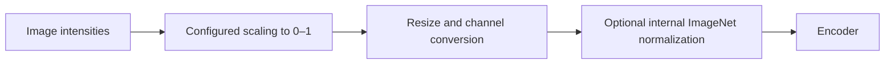

# Normalize image intensities

[All configuration](README.md) · [Dataset guide](../data.md)

Image scaling converts intensities into the range `[0, 1]`.
Set `normalization` on `Segmenter`, `SegmenterConfig`, or `ExperimentConfig`.
The same policy applies during training and prediction. Checkpoints retain it.

| Mode | Configuration | Behavior |
| --- | --- | --- |
| Standard | `{"mode": "standard"}` | Default. Divide uint8 by 255. Accept finite floats already in `[0, 1]`. |
| Dtype | `{"mode": "dtype"}` | Divide unsigned integers by their dtype maximum. For uint16, this is 65535. |
| Range | `{"mode": "range", "min": 0, "max": 4095}` | Clip and scale with explicit finite limits. Require `min < max`. |
| Percentile | `{"mode": "percentile", "lower": 1, "upper": 99}` | Clip and scale per image. Defaults are 1 and 99. Require `0 <= lower < upper <= 100`. |

Constant percentile images become zero. Empty images and nonfinite intensities cause an error.
The standard policy rejects uint16 images. Select an explicit policy for these images.
The dtype policy accepts unsigned integers only.

```python
from bicbioseg import Segmenter

model = Segmenter(
    architecture="unext_full",
    in_channels=1,
    normalization={"mode": "dtype"},
    ignore_index=255,
    model_kwargs={"variant": "small"},
)
```

Here, 255 identifies an unannotated mask pixel. Choose a value distinct from the foreground and class IDs.
Image normalization does not change mask labels.

## Encoder normalization is a separate step



The default uint8 path resizes before scaling. Explicit intensity policies scale before resizing.
ResNet-50 TransUNet and all timm models apply ImageNet normalization internally by default.
This applies even with random encoder weights. Grayscale repeats to RGB for these encoders.
Custom TransUNet defaults to no internal normalization. Other local models do not add this ImageNet step.

Do not apply ImageNet normalization again to inputs from the package loader.
For already-normalized tensors supplied directly to a supported model, set `model_kwargs={"normalize_input": False}`.
This option disables encoder normalization. It does not disable the loader's intensity policy or grayscale conversion.
