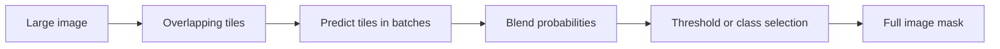

# Predict masks

[Documentation](README.md) · [Main guide](../README.md)

Load a trained checkpoint, then select whole-image, tiled, or ensemble prediction.

Load a checkpoint:

```python
from bicbioseg import Segmenter

model = Segmenter.load("experiments/unet_dice/best_model.pt")
```

Run folder inference:

```python
predictions = model.inference(
    images="new_images",
    save_to="predictions",
    save_overlay=True,
    save_probability=True,
    save_logits=True,
    save_contours=True,
)
```

Single-image prediction:

```python
mask, overlay = model.predict_one(
    "new_images/cell.png",
    save_to="predictions/cell_mask.png",
    return_overlay=True,
)
```

Large-image tiled inference:

```python
model.inference_large_image(
    image="large_image.tif",
    patch_size=(512, 512),
    overlap=64,
    tile_batch_size=4,
    weighting="gaussian",
    save_to="large_predictions",
)
```

`tile_batch_size` controls how many tiles share a forward pass.
`weighting="gaussian"` reduces edge weights. Its default sigma is 0.125 of the tile size.
Uniform averaging remains the default. Partial tiles are padded, then cropped before their contributions are combined.
Ensemble multiple checkpoints:

```python
Segmenter.ensemble_predict(
    checkpoints=[
        "experiments/unet_dice/best_model.pt",
        "experiments/cattention_unet_dice/best_model.pt",
    ],
    images="test/images",
    save_to="ensemble_predictions",
)
```

Plot inference results:

```python
model.plot_inference_results(
    images="test/images",
    predictions=predictions,
    save_to="predictions/inference_grid.png",
)
```

## Choose an output

Binary prediction applies sigmoid and `threshold=0.5` by default. Saved foreground pixels use value 255.
Multiclass prediction selects the highest-scoring class. Saved pixels contain class IDs.
Whole-image prediction resizes input to `image_size`, then restores predictions to the source size.

| Folder inference option | Default | Result |
| --- | --- | --- |
| `save_to` | `"predictions"` | Output directory for masks. |
| `threshold` | `0.5` | Binary probability cutoff. |
| `return_arrays` | `False` | Return arrays instead of saved mask paths. |
| `save_overlay` | `False` | Save image/mask overlays. |
| `save_probability` | `False` | Save probabilities as NumPy arrays. |
| `save_logits` | `False` | Save logits as NumPy arrays. |
| `save_contours` | `False` | Save contour images. |

`predict_one` accepts `threshold=0.5`, `save_to=None`, `return_overlay=False`, and `show=False`.

## Tiled prediction settings



| Option | Default | Purpose |
| --- | --- | --- |
| `patch_size` | `(512, 512)` | Tile height and width in source pixels. |
| `overlap` | `64` | Shared pixels. Must be nonnegative and smaller than both tile dimensions. |
| `tile_batch_size` | `1` | Positive number of tiles per forward pass. |
| `weighting` | `"uniform"` | Equal weights. `"gaussian"` reduces the influence of tile edges. |
| `gaussian_sigma` | `0.125` | Positive Gaussian width as a fraction of tile size. |
| `threshold` | `0.5` | Binary cutoff in `[0, 1]`. |
| `save_to` | `"predictions"` | Output directory. |
| `save_overlay` | `True` | Save an overlay. |
| `save_probability` | `False` | Save probabilities. |

Each tile uses the model's `image_size` for the forward pass. Tile logits resize to the tile's source size before activation and probability blending.

Ensemble checkpoints must use the same class count and class order.
`ensemble_predict` averages probabilities. Its options are `save_to`, `threshold=0.5`, `device=None`, and `save_overlay=True`.

## Batch folder prediction and structured results

```python
from bicbioseg import Segmenter

model = Segmenter.load("experiments/unet_dice/best_model.pt")
results = model.inference(
    "new_images", save_to="predictions", batch_size=8,
    structured=True, return_arrays=True, save_probability=True,
)
print(results[0]["paths"]["mask"])
print(results[0]["metadata"]["threshold"])
```

`batch_size` defaults to 1. Each image resizes to the configured input size, then its scores return to its original dimensions.
Folder batches can contain different source image sizes. Duplicate source stems cause an error before outputs are written.
Ensemble prediction also accepts `batch_size`, `return_arrays`, `save_probability`, and `structured`.
Ensemble class counts and saved class maps must match.

Set `structured=True` on any prediction method for the shared record format:

| Field | Contents |
| --- | --- |
| `source` | Absolute source image path |
| `shape` | Output mask height and width |
| `paths` | Saved mask, overlay, probability, logits, or contour paths |
| `metadata` | Architecture, checkpoint, completed epoch, dataset identity, threshold, class map, and preprocessing settings |
| `mask` | Mask array when arrays are requested, otherwise `None` |
| `probability` | Probability array when requested, otherwise `None` |
| `logits` | Raw scores when available and requested, otherwise `None` |

Folder and ensemble prediction return a list of records. Single-image and tiled prediction return one record.
`predict_one(structured=True)` includes arrays. Folder, tiled, and ensemble methods use `return_arrays=True` to include arrays.
Tiled and ensemble records do not provide raw logits. Tiled metadata also records tile settings.

Saved outputs always include a JSON manifest without array contents.
Folder and ensemble manifests are `predictions.json`. Single-image saves use the mask path with a `.json` suffix.
Tiled saves use `<source_stem>_prediction.json`.
Binary manifests retain the selected threshold. Multiclass threshold is `null`, because prediction uses class argmax.
Set `class_map={0: "background", 1: "cell"}` when creating the model to retain meaningful class names in checkpoints and outputs.
