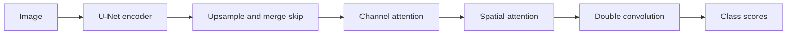

# CAttention U-Net

[All models](README.md) · [Main guide](../../README.md)

U-Net with channel and spatial attention in each decoder stage.

Architecture name: `cattention_unet`. Aliases: cattunet, cattention-u-net.



The diagram shows the main flow. Skip connections carry encoder features into the decoder where described.

## Create the model

```python
from bicbioseg import Segmenter

model = Segmenter(
    architecture="cattention_unet",
    image_size=(224, 320),
    in_channels=3,
    num_classes=1,
    model_kwargs={"base_channels": 8, "num_decoder_blocks": 5, "bilinear": True},
)
```

## Configure the model

Pass these options through `model_kwargs`. Set `in_channels`, `num_classes`, and `image_size` on `Segmenter`.

| Option | Default | Purpose and accepted values |
| --- | --- | --- |
| `num_decoder_blocks` | `4` | Number of encoder and decoder stages. Use an integer from 1 to 8. |
| `base_channels` | `16` | Width of the first stage. Use a positive integer. |
| `bilinear` | `False` | Use transposed convolutions. Set `True` for bilinear upsampling. |


## Inputs and behavior

Each dimension must be at least `2**num_decoder_blocks`. Odd and rectangular sizes are supported. Training BatchNorm needs multiple values per channel.

Each decoder has one convolutional block attention module (CBAM). Its channel reduction ratio is 8. Its spatial kernel is 7 × 7. These values are fixed. The encoder and bottleneck have no CBAM.

Use `model.model.get_architecture_info()` to inspect the model. Use `model.model.calculate_max_decoder_blocks(image_size)` to check the depth limit.

The model starts from random weights. It has no pretrained option or auxiliary output.

## Compare attention with U-Net

Keep the dataset split, seed, loss, image size, width, depth, upsampling mode, and training settings equal. Then compare `unet` with `cattention_unet`. This isolates the addition of CBAM. The configurable version replaces the older fixed-width model. Do not assume that legacy checkpoints are compatible.

## Direct PyTorch use

Import `CAttentionUNet` from `bicbioseg.models.cattention_unet`. The input/output constructor arguments are `n_channels`, `n_classes`, `image_size`.
`Segmenter` supplies these arguments from its shared settings. Do not pass conflicting values in `model_kwargs`.

For direct constructors, input channels default to 3. Output classes default to 1.
Direct `image_size` defaults to `None` and validates depth without fixing the forward resolution.

Inputs use `(batch, channels, height, width)`. Outputs contain raw class scores, called logits.


Continue with [training](../training.md), [shared configuration](../configuration/segmenter.md), or the [source](../../src/bicbioseg/models/cattention_unet.py).
