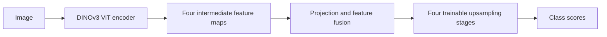

# DINOv3 with trainable segmentation decoder

[All models](README.md) · [Main guide](../../README.md)

Use DINOv3 image features with a convolutional decoder trained for your segmentation labels.

Architecture name: `dinov3_seg`. No aliases.



The decoder combines features from four encoder depths on the same patch grid.
It learns how to convert these features into masks for your dataset.

## Create the model

```python
from bicbioseg import Segmenter

model = Segmenter(
    architecture="dinov3_seg",
    image_size=(224, 320),
    in_channels=3,
    num_classes=1,
    model_kwargs={"variant": "small", "pretrained": False},
)
```

## Configure the model

Pass these options through `model_kwargs`. Set `in_channels`, `num_classes`, and `image_size` on `Segmenter`.

| Option | Default | Purpose and accepted values |
| --- | --- | --- |
| `variant` | `'small'` | Choose `small` or `base`. Both use 16-pixel patches. |
| `pretrained` | `False` | Set `True` to request DINOv3 LVD-1689M encoder weights. The decoder starts from random weights. |
| `decoder_channels` | `(128, 64, 32, 16)` | Four positive upsampling widths, from coarse to fine. The first width also controls feature fusion. |
| `dropout` | `0.1` | Dropout before the output layer. Use `0 <= dropout < 1`. |
| `freeze_encoder` | `False` | Disable encoder gradients and keep the encoder in evaluation mode. The decoder remains trainable. |
| `normalize_input` | `True` | Apply ImageNet mean and standard deviation inside the model. See [normalization](../configuration/normalization.md). |

## Inputs and behavior

Install `bicbioseg[transformers]`. The model uses `timm>=1.0.25,<2`.
Use one grayscale channel or three RGB channels. Grayscale repeats to RGB inside the model.
Inputs are padded to multiples of 16, and outputs are cropped to the original size.
Rectangular and odd sizes are supported. Inputs to internal normalization should be in `[0, 1]`.

For a small labeled dataset, start with `pretrained=True` and `freeze_encoder=True`
to train only the decoder. Set `freeze_encoder=False` when you want to fine-tune the
encoder as well. Dataset size does not automatically change these settings.
With `pretrained=False`, both encoder and decoder start from random weights;
freezing that encoder does not provide pretrained features.

The encoder weight identifiers are `vit_small_patch16_dinov3.lvd1689m` and
`vit_base_patch16_dinov3.lvd1689m`. Feature maps come from blocks 3, 6, 9, and 12;
they all have stride 16. Learned projections and convolutional fusion combine them
before four 2x upsampling stages. This is a bicbioseg decoder, not Meta's pretrained
segmentation head. Deep supervision is not exposed for this model.

Requesting pretrained weights can download a checkpoint. The weights retain the
[DINOv3 license](https://github.com/facebookresearch/dinov3/blob/main/LICENSE.md).
See the [DINOv3 reference](https://github.com/facebookresearch/dinov3).
Loading a saved bicbioseg checkpoint does not download encoder initialization weights again.

## Direct PyTorch use

Import `DINOv3Segmenter` from `bicbioseg.models.dinov3_seg`. The input/output constructor arguments are `in_channels`, `n_classes`.
`Segmenter` supplies these arguments from its shared settings. Do not pass conflicting values in `model_kwargs`.

For direct constructors, input channels default to 3. Output classes default to 1.
Inputs use `(batch, channels, height, width)`. Outputs contain raw class scores, called logits.

Continue with [training](../training.md), [shared configuration](../configuration/segmenter.md), or the [source](../../src/bicbioseg/models/dinov3_seg.py).
