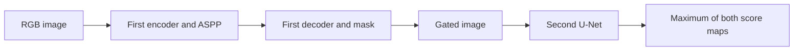

# DoubleUNet

[All models](README.md) · [Main guide](../../README.md)

Two U-Nets refine a binary mask. The first prediction gates the image before the second encoder.

Architecture name: `double_unet`. Aliases: doubleunet.



The diagram shows the main flow. Skip connections carry encoder features into the decoder where described.

## Create the model

```python
from bicbioseg import Segmenter

model = Segmenter(
    architecture="double_unet",
    image_size=(224, 320),
    in_channels=3,
    num_classes=1,
    model_kwargs={"backbone": "resnet50", "pretrained": False},
)
```

## Configure the model

Pass these options through `model_kwargs`. Set `in_channels`, `num_classes`, and `image_size` on `Segmenter`.

| Option | Default | Purpose and accepted values |
| --- | --- | --- |
| `backbone` | `'vgg19'` | First encoder: `vgg19`, `resnet50`, or `resnet101`. The second encoder is fixed. |
| `pretrained` | `False in Segmenter` | Set `True` to request torchvision weights for the first encoder. Direct `DoubleUNet()` defaults to `True`. |


## Inputs and behavior

Use `in_channels=3` and `num_classes=1`. Other combinations are unsupported by `Segmenter`. Choose dimensions divisible by 16. Dimensions of at least 32 are recommended.

ASPP combines features at different dilation rates. Both decoders use encoder skip features. The final output contains raw logits.

The public options do not include decoder widths, encoder freezing, internal ImageNet normalization, or deep supervision. Request pretrained weights explicitly if you need them. This can download weights.

`model.model.get_architecture_info()` reports the backbone and parameter counts.

## Direct PyTorch use

Import `DoubleUNet` from `bicbioseg.models.doubleunet`. The input/output constructor arguments are `n_classes`.
`Segmenter` supplies these arguments from its shared settings. Do not pass conflicting values in `model_kwargs`.

For direct constructors, input channels default to 3. Output classes default to 1.


Inputs use `(batch, channels, height, width)`. Outputs contain raw class scores, called logits.


Continue with [training](../training.md), [shared configuration](../configuration/segmenter.md), or the [source](../../src/bicbioseg/models/doubleunet.py).
