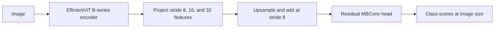

# EfficientViT segmentation

[All models](README.md) · [Main guide](../../README.md)

Use MIT EfficientViT's multiscale linear attention with a lightweight segmentation head.

Architecture name: `efficientvit_seg`. No aliases.



The head fuses three encoder scales by addition and refines them with mobile
inverted bottleneck convolutions (MBConv). It follows the B-series Cityscapes
head design with configurable output classes.

## Create the model

```python
from bicbioseg import Segmenter

model = Segmenter(
    architecture="efficientvit_seg",
    image_size=(224, 320),
    in_channels=3,
    num_classes=1,
    model_kwargs={"variant": "b0", "pretrained": False},
)
```

## Configure the model

Pass these options through `model_kwargs`. Set `in_channels`, `num_classes`, and `image_size` on `Segmenter`.

| Option | Default | Purpose and accepted values |
| --- | --- | --- |
| `variant` | `'b0'` | Choose `b0`, `b1`, `b2`, or `b3`. |
| `pretrained` | `False` | Set `True` to request ImageNet encoder weights. The segmentation head starts from random weights. |
| `decoder_channels` | `None` | Positive head width. `None` selects the variant preset below. |
| `decoder_depth` | `None` | Positive number of residual MBConv blocks. `None` selects the variant preset below. |
| `dropout` | `0.0` | Dropout before the output layer. Use `0 <= dropout < 1`. |
| `freeze_encoder` | `False` | Disable encoder gradients and keep the encoder in evaluation mode. |
| `normalize_input` | `True` | Apply ImageNet mean and standard deviation inside the model. See [normalization](../configuration/normalization.md). |

## Inputs and behavior

| Variant | Head width | Head depth |
| --- | --- | --- |
| `b0` | 32 | 1 |
| `b1` | 64 | 3 |
| `b2` | 96 | 3 |
| `b3` | 128 | 3 |

The head uses expansion ratio 4 in its MBConv blocks and final projection,
with Hardswish activations and BatchNorm. `b0` is the smallest option.
Deep supervision is not exposed for this model.

Use one grayscale channel or three RGB channels. Grayscale repeats to RGB inside
the model. Inputs are padded to multiples of 32. Class scores are resized to the
padded input size and cropped to the original size. Rectangular and odd sizes
are supported. Inputs to internal normalization should be in `[0, 1]`.

For training, ensure `batch_size * ceil(height/32) * ceil(width/32) > 1` for
BatchNorm. This also applies to the head when the encoder is frozen.

Install `bicbioseg[transformers]`. The model uses `timm>=1.0.25,<2` and the
encoder identifier `efficientvit_{variant}.r224_in1k`. A weight download can occur
when `pretrained=True`. Pretraining initializes only the encoder; Cityscapes or
ADE20K segmentation checkpoints are not loaded. Restoring a bicbioseg checkpoint
does not download initialization weights again.

See the [MIT EfficientViT reference](https://github.com/mit-han-lab/efficientvit)
and the [included attribution](../../src/bicbioseg/models/licenses/NOTICE.txt).

## Direct PyTorch use

Import `EfficientViTSegmenter` from `bicbioseg.models.efficientvit_seg`. The input/output constructor arguments are `in_channels`, `n_classes`.
`Segmenter` supplies these arguments from its shared settings. Do not pass conflicting values in `model_kwargs`.

For direct constructors, input channels default to 3. Output classes default to 1.
Inputs use `(batch, channels, height, width)`. Outputs contain raw class scores, called logits.

Continue with [training](../training.md), [shared configuration](../configuration/segmenter.md), or the [source](../../src/bicbioseg/models/efficientvit_seg.py).
