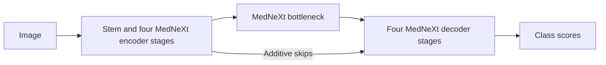

# MedNeXt in 2D

[All models](README.md) · [Main guide](../../README.md)

Use ConvNeXt-style residual blocks throughout a biomedical encoder-decoder.

Architecture name: `mednext_2d`. No aliases.



Depthwise convolutions, per-channel GroupNorm, and channel expansion/compression
form each block. Residual downsampling and upsampling learn the changes in resolution.

## Create the model

```python
from bicbioseg import Segmenter

model = Segmenter(
    architecture="mednext_2d",
    image_size=(224, 320),
    in_channels=1,
    num_classes=1,
    model_kwargs={"variant": "small", "deep_supervision": True},
)
```

## Configure the model

Pass these options through `model_kwargs`. Set `in_channels`, `num_classes`, and `image_size` on `Segmenter`.

| Option | Default | Purpose and accepted values |
| --- | --- | --- |
| `variant` | `'small'` | Choose `small` or `base`. Controls channel expansion ratios inside blocks. |
| `base_channels` | `32` | Positive first-stage width. Each subsequent encoder stage doubles the width. |
| `kernel_size` | `3` | Positive odd depthwise kernel size, such as `3`, `5`, or `7`. |
| `block_counts` | `(2, 2, 2, 2, 2, 2, 2, 2, 2)` | Nine positive block counts: four encoder stages, bottleneck, then four decoder stages from coarse to fine. |
| `deep_supervision` | `False` | Add four auxiliary heads during training. |

## Inputs and behavior

The default encoder widths are `(32, 64, 128, 256, 512)`, including the bottleneck.
The decoder reverses these widths. Variant `small` expands channels by 2 in all
nine stages. Variant `base` uses `(2, 3, 4, 4, 4, 4, 4, 3, 2)` in stage order.
Residual connections are enabled in the blocks and resampling layers.

Inputs are padded to multiples of 16, with a minimum of 32 in each dimension.
This keeps at least a 2x2 bottleneck for GroupNorm, including with batch size 1.
Outputs are cropped to the original size. Rectangular and odd sizes are supported.

The model supports binary and multiclass outputs. Direct tensors can use any
positive channel count. The file loader supports grayscale and RGB images.
There is no internal ImageNet normalization.

Weights start from random values. There is no pretrained option and no optional
installation requirement. This is a 2D adaptation of MedNeXt v1; it does not load
upstream 3D checkpoints or include nnU-Net's dataset planning and training pipeline.
See the [MedNeXt reference](https://github.com/MIC-DKFZ/MedNeXt) and the
[included attribution](../../src/bicbioseg/models/licenses/NOTICE.txt).

With deep supervision, auxiliary predictions originate at strides 2, 4, 8, and 16,
in that order. Each is resized and cropped to the input geometry. Custom
`aux_loss_weights` must contain four entries; the default is 0.4 for each head.
See [training configuration](../configuration/training.md).

## Direct PyTorch use

Import `MedNeXt2D` from `bicbioseg.models.mednext_2d`. The input/output constructor arguments are `in_channels`, `n_classes`.
`Segmenter` supplies these arguments from its shared settings. Do not pass conflicting values in `model_kwargs`.

For direct constructors, input channels default to 3. Output classes default to 1.
Inputs use `(batch, channels, height, width)`. Outputs contain raw class scores, called logits.
With deep supervision, training returns a dictionary with `logits` and four `aux_logits`.
Evaluation returns only the main logits.

Continue with [training](../training.md), [shared configuration](../configuration/segmenter.md), or the [source](../../src/bicbioseg/models/mednext_2d.py).
