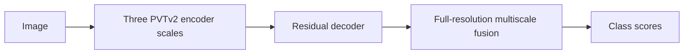

# PVTFormer

[All models](README.md) · [Main guide](../../README.md)

Use a transformer encoder with a segmentation decoder.

Architecture name: `pvtformer_full`. Aliases: pvtformer.



The diagram shows the main flow. Skip connections carry encoder features into the decoder where described.

## Create the model

```python
from bicbioseg import Segmenter

model = Segmenter(
    architecture="pvtformer_full",
    image_size=(224, 320),
    in_channels=3,
    num_classes=1,
    model_kwargs={"variant": "b3", "pretrained": False},
)
```

## Configure the model

Pass these options through `model_kwargs`. Set `in_channels`, `num_classes`, and `image_size` on `Segmenter`.

| Option | Default | Purpose and accepted values |
| --- | --- | --- |
| `variant` | `'b3'` | Encoder size. Supported values appear below. |
| `pretrained` | `False` | Set `True` to request ImageNet encoder weights. The decoder starts from random weights. |
| `decoder_channels` | `64` | Positive width for scale reductions, residual decoding, and feature fusion. |
| `dropout` | `0.0` | Dropout probability in the decoder or output head. Use `0 <= dropout < 1`. |
| `freeze_encoder` | `False` | Set `True` to disable encoder gradients and keep the encoder in evaluation mode. |
| `normalize_input` | `True` | Apply ImageNet mean and standard deviation inside the model. See [normalization](../configuration/normalization.md). |
| `deep_supervision` | `False` | Add two auxiliary prediction heads during training. See [training configuration](../configuration/training.md). |


## Inputs and behavior

Choose `b0`, `b1`, `b2`, `b3`, `b4`, or `b5`. This model uses the first three PVTv2 scales. It combines the decoded map and three encoder maps at full resolution.

The `b3` default differs from the `b0` default in [PVT U-Net](pvt_unet.md).

Inputs are padded to multiples of 32. Outputs are cropped to the original size.

Use one grayscale channel or three RGB channels. Grayscale repeats to RGB inside the model. Rectangular and odd sizes are supported.

Install `bicbioseg[transformers]`. The model uses `timm>=1.0.25,<2`. Pretrained weights apply only to the encoder. A weight download can occur when `pretrained=True`.

The encoder weight identifier is `pvt_v2_{variant}.in1k`.

## Direct PyTorch use

Import `PVTFormerFull` from `bicbioseg.models.pvtformer_full`. The input/output constructor arguments are `in_channels`, `n_classes`.
`Segmenter` supplies these arguments from its shared settings. Do not pass conflicting values in `model_kwargs`.

For direct constructors, input channels default to 3. Output classes default to 1.


Inputs use `(batch, channels, height, width)`. Outputs contain raw class scores, called logits.
With deep supervision, training returns a dictionary with `logits` and two `aux_logits`. Evaluation returns only the main logits.

Continue with [training](../training.md), [shared configuration](../configuration/segmenter.md), or the [source](../../src/bicbioseg/models/pvtformer_full.py).
