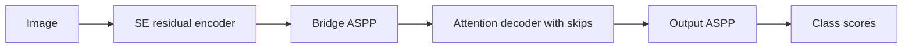

# ResUNet++

[All models](README.md) · [Main guide](../../README.md)

Residual convolutional blocks use squeeze-and-excitation (SE) and decoder attention.

Architecture name: `resunetplusplus_full`. Aliases: resunetplusplus, resunet++.



The diagram shows the main flow. Skip connections carry encoder features into the decoder where described.

## Create the model

```python
from bicbioseg import Segmenter

model = Segmenter(
    architecture="resunetplusplus_full",
    image_size=(224, 320),
    in_channels=3,
    num_classes=1,
    model_kwargs={"base_channels": 16, "aspp_rates": (1, 6, 12, 18), "deep_supervision": True},
)
```

## Configure the model

Pass these options through `model_kwargs`. Set `in_channels`, `num_classes`, and `image_size` on `Segmenter`.

| Option | Default | Purpose and accepted values |
| --- | --- | --- |
| `base_channels` | `16` | Positive width of the first encoder stage. |
| `aspp_rates` | `(1, 6, 12, 18)` | Nonempty sequence of positive dilation rates. Both ASPP modules use these rates. |
| `deep_supervision` | `False` | Add two auxiliary heads during training. |


## Inputs and behavior

Positive spatial dimensions are padded to multiples of 8, with a minimum of 16. The output is cropped to the original size.

The model supports binary and multiclass outputs. Direct tensor inputs can use any positive channel count. The file loader supports grayscale and RGB images.

Weights start from random values. There is no pretrained option. See [training configuration](../configuration/training.md) for auxiliary loss weights.

## Direct PyTorch use

Import `ResUNetPlusPlusFull` from `bicbioseg.models.resunetplusplus_full`. The input/output constructor arguments are `in_channels`, `n_classes`.
`Segmenter` supplies these arguments from its shared settings. Do not pass conflicting values in `model_kwargs`.

For direct constructors, input channels default to 3. Output classes default to 1.


Inputs use `(batch, channels, height, width)`. Outputs contain raw class scores, called logits.
With deep supervision, training returns a dictionary with `logits` and two `aux_logits`. Evaluation returns only the main logits.

Continue with [training](../training.md), [shared configuration](../configuration/segmenter.md), or the [source](../../src/bicbioseg/models/resunetplusplus_full.py).
