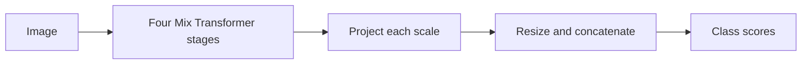

# SegFormer

[All models](README.md) · [Main guide](../../README.md)

A local Mix Transformer encoder combines four feature scales with a projection decoder.

Architecture name: `segformer`. Aliases: None.



The diagram shows the main flow. Skip connections carry encoder features into the decoder where described.

## Create the model

```python
from bicbioseg import Segmenter

model = Segmenter(
    architecture="segformer",
    image_size=(224, 320),
    in_channels=3,
    num_classes=1,
    model_kwargs={"dims": (32, 64, 160, 256), "num_layers": 2, "decoder_dim": 128},
)
```

## Configure the model

Pass these options through `model_kwargs`. Set `in_channels`, `num_classes`, and `image_size` on `Segmenter`.

| Option | Default | Purpose and accepted values |
| --- | --- | --- |
| `dims` | `(32, 64, 160, 256)` | Feature widths for the four encoder stages. |
| `heads` | `(1, 2, 5, 8)` | Attention heads per stage. Each width must be divisible by its head count. |
| `ff_expansion` | `(8, 8, 4, 4)` | Feed-forward expansion factors per stage. |
| `reduction_ratio` | `(8, 4, 2, 1)` | Spatial reduction ratios for attention per stage. |
| `num_layers` | `2` | Transformer layers per stage. A scalar repeats across all four stages. |
| `decoder_dim` | `256` | Projection width for each scale in the decoder. |


## Inputs and behavior

Use dimensions of at least 32 with the default reduction ratios. Custom ratios require sufficiently large feature maps at each stage. Rectangular inputs are supported.

`dims`, `heads`, `ff_expansion`, `reduction_ratio`, and `num_layers` accept a scalar or a tuple of four values. Use tuples for stage-specific settings. Lists from JSON are converted to stage tuples automatically.

The direct model returns scores at the first encoder scale, approximately one-quarter resolution. `Segmenter` resizes these scores to the input resolution.

This local implementation starts from random weights. It has no named B0–B5 presets, pretrained option, or deep supervision. PVTv2 B0–B5 variants belong to the PVT model pages.

## Direct PyTorch use

Import `Segformer` from `bicbioseg.models.segformer`. The input/output constructor arguments are `channels`, `num_classes`.
`Segmenter` supplies these arguments from its shared settings. Do not pass conflicting values in `model_kwargs`.

For direct constructors, input channels default to 3. Output classes default to 4.


Inputs use `(batch, channels, height, width)`. Outputs contain raw class scores, called logits.


Continue with [training](../training.md), [shared configuration](../configuration/segmenter.md), or the [source](../../src/bicbioseg/models/segformer.py).
