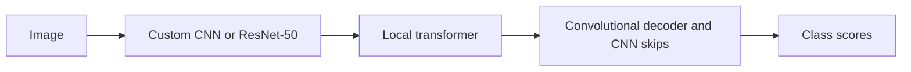

# TransUNet

[All models](README.md) · [Main guide](../../README.md)

A CNN creates image features and skips. A local transformer processes the deepest features. A convolutional decoder restores spatial detail.

Architecture name: `transunet`. Aliases: trans_unet.



The diagram shows the main flow. Skip connections carry encoder features into the decoder where described.

## Create the model

```python
from bicbioseg import Segmenter

model = Segmenter(
    architecture="transunet",
    image_size=(224, 320),
    in_channels=3,
    num_classes=1,
    model_kwargs={"preset": "lightweight", "out_channels": 32, "embedding_dim": 256,
                  "head_num": 8, "mlp_dim": 1024, "block_num": 4,
                  "decoder_channels": (128, 64, 32, 16), "n_skip": 3},
)
```

## Configure the model

Pass these options through `model_kwargs`. Set `in_channels`, `num_classes`, and `image_size` on `Segmenter`.

| Option | Default | Purpose and accepted values |
| --- | --- | --- |
| `preset` | `'standard'` | Choose `lightweight`, `standard`, `heavy`, or `None`. `None` uses standard defaults. |
| `encoder_name` | `'custom'` | Choose `custom` or `resnet50` for the CNN. |
| `encoder_weights` | `None` | For ResNet-50: `None`, `DEFAULT`, `IMAGENET1K_V1`, or `IMAGENET1K_V2`. |
| `out_channels` | `None` | Preset CNN width. Must be at least 8. For ResNet-50, controls the post-transformer bottleneck and default decoder widths. |
| `embedding_dim` | `None` | Transformer width. Defaults to `8 * out_channels`. Must be divisible by `head_num`. |
| `head_num` | `None` | Positive attention head count from the preset. |
| `mlp_dim` | `None` | Positive transformer feed-forward width from the preset. |
| `block_num` | `None` | Positive transformer block count from the preset. |
| `patch_dim` | `None` | Resolves to 16. The CNN stride is fixed. Other values are unsupported. |
| `decoder_channels` | `None` | Four positive widths, deepest to shallowest. Defaults to `(2*c, c, c//2, c//8)`, where `c=out_channels`. |
| `dropout` | `0.1` | Transformer dropout. Use `0 <= dropout < 1`. |
| `n_skip` | `3` | Number of CNN skips, from 0 to 3. The deepest skips are used first. |
| `normalize_input` | `None` | Defaults to `False` for the custom CNN and `True` for ResNet-50. |
| `pretrained_vit` | `False` | Must remain `False`. Pretrained ViT weights are unsupported. |


## Inputs and behavior

Both dimensions must be divisible by 16. Rectangular images are supported. Position embeddings interpolate for other valid input sizes.

Explicit values override preset values. The presets select these defaults:

| Preset | `out_channels` | `embedding_dim` if omitted | `head_num` | `mlp_dim` | `block_num` | `patch_dim` |
| --- | --- | --- | --- | --- | --- | --- |
| `lightweight` | 64 | 512 | 4 | 512 | 6 | 16 |
| `standard` | 128 | 1024 | 4 | 512 | 8 | 16 |
| `heavy` | 256 | 2048 | 8 | 1024 | 12 | 16 |

## Use a pretrained CNN

```python
from bicbioseg import Segmenter

model = Segmenter(
    architecture="transunet",
    image_size=(224, 320),
    in_channels=1,
    model_kwargs={
        "encoder_name": "resnet50",
        "encoder_weights": "IMAGENET1K_V2",
        "out_channels": 64,
        "embedding_dim": 512,
        "head_num": 8,
        "mlp_dim": 2048,
        "block_num": 6,
        "decoder_channels": (256, 128, 64, 32),
    },
)
```

This option needs torchvision, which is a base dependency. It does not need the transformers extra. Requested weights can download through torchvision.

The ResNet stem and layers 1–3 provide stride-16 features and three skips. ResNet CNN widths are fixed. The transformer and decoder start from random weights. Official hybrid R50–ViT `.npz` checkpoints are incompatible with this implementation.

ResNet-50 accepts one or three input channels. Grayscale repeats to RGB internally. The custom CNN accepts other channel counts when `normalize_input=False`. File input still requires grayscale or RGB.

See [normalization](../configuration/normalization.md) before you supply tensors directly. `model.model.get_architecture_info()` reports the resolved configuration.

## Choose a different transformer family

DeiT and PVTv2 are separate architectures in this library. They are not values for TransUNet's `encoder_name`. Use [`deit`](deit.md), [`pvt_unet`](pvt_unet.md), or [`pvtformer_full`](pvtformer_full.md). Swin also has [convolutional](swin_unet.md) and [Swin decoder](swin_unet_full.md) choices.

## Reuse older checkpoints

Attention scaling now uses the square root of head width. Existing compatible TransUNet checkpoints can load, but predictions can change. Evaluate them again before reuse.

## Direct PyTorch use

Import `TransUNet` from `bicbioseg.models.transunet`. The input/output constructor arguments are `in_channels`, `n_classes`, `img_dim`.
`Segmenter` supplies these arguments from its shared settings. Do not pass conflicting values in `model_kwargs`.

For direct constructors, input channels default to 3. Output classes default to 1.
Direct `img_dim` defaults to `224` and accepts an integer or a height/width pair.

Inputs use `(batch, channels, height, width)`. Outputs contain raw class scores, called logits.


Continue with [training](../training.md), [shared configuration](../configuration/segmenter.md), or the [source](../../src/bicbioseg/models/transunet.py).
