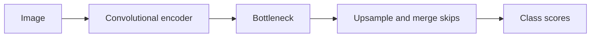

# U-Net

[All models](README.md) · [Main guide](../../README.md)

Convolutional encoder and decoder with skip connections. Use it to establish a baseline.

Architecture name: `unet`. Aliases: u-net.



The diagram shows the main flow. Skip connections carry encoder features into the decoder where described.

## Create the model

```python
from bicbioseg import Segmenter

model = Segmenter(
    architecture="unet",
    image_size=(224, 320),
    in_channels=3,
    num_classes=1,
    model_kwargs={"base_channels": 16, "num_decoder_blocks": 4, "bilinear": False},
)
```

## Configure the model

Pass these options through `model_kwargs`. Set `in_channels`, `num_classes`, and `image_size` on `Segmenter`.

| Option | Default | Purpose and accepted values |
| --- | --- | --- |
| `num_decoder_blocks` | `4` | Number of downsampling and decoder stages. Use an integer from 1 to 8. |
| `base_channels` | `16` | Width of the first stage. Use a positive integer. Width doubles at each encoder stage. |
| `bilinear` | `False` | Use transposed convolutions. Set `True` to use bilinear upsampling. |


## Inputs and behavior

Each dimension must be at least `2**num_decoder_blocks`. Odd and rectangular sizes are supported.

Training BatchNorm needs more than one value per channel at the bottleneck. Increase the batch or image size if necessary.

`model.model.calculate_max_decoder_blocks(image_size)` reports the depth limit. `model.model.get_architecture_info()` reports widths and parameter counts.

The model starts from random weights. It has no pretrained option or auxiliary output.

## Direct PyTorch use

Import `UNet` from `bicbioseg.models.unet`. The input/output constructor arguments are `n_channels`, `n_classes`, `image_size`.
`Segmenter` supplies these arguments from its shared settings. Do not pass conflicting values in `model_kwargs`.

For direct constructors, input channels default to 3. Output classes default to 1.
Direct `image_size` defaults to `None` and validates depth without fixing the forward resolution.

Inputs use `(batch, channels, height, width)`. Outputs contain raw class scores, called logits.


Continue with [training](../training.md), [shared configuration](../configuration/segmenter.md), or the [source](../../src/bicbioseg/models/unet.py).
