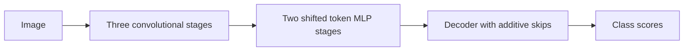

# UNeXt

[All models](README.md) · [Main guide](../../README.md)

Convolutional stages and shifted token multilayer perceptrons (MLPs) encode the image.

Architecture name: `unext_full`. Aliases: unext.



The diagram shows the main flow. Skip connections carry encoder features into the decoder where described.

## Create the model

```python
from bicbioseg import Segmenter

model = Segmenter(
    architecture="unext_full",
    image_size=(224, 320),
    in_channels=3,
    num_classes=1,
    model_kwargs={"variant": "small", "deep_supervision": True},
)
```

## Configure the model

Pass these options through `model_kwargs`. Set `in_channels`, `num_classes`, and `image_size` on `Segmenter`.

| Option | Default | Purpose and accepted values |
| --- | --- | --- |
| `variant` | `'base'` | Choose `base` or `small`. |
| `widths` | `None` | Optional five positive stage widths. These replace the variant widths. |
| `dropout` | `0.0` | Dropout inside shifted MLP blocks. Use `0 <= dropout < 1`. |
| `deep_supervision` | `False` | Add two auxiliary heads during training. |


## Inputs and behavior

Variant `base` uses widths `(16, 32, 128, 160, 256)`. Variant `small` uses `(8, 16, 32, 64, 128)`. Shift size is fixed at 5.

Inputs are padded to multiples of 32. Outputs are cropped to the original size. For training, ensure `batch_size * ceil(height/32) * ceil(width/32) > 1` for BatchNorm.

The model supports binary and multiclass outputs. Direct tensors can use any positive channel count. The file loader supports grayscale and RGB images.

Weights start from random values. There is no pretrained option. See [training configuration](../configuration/training.md) for auxiliary loss weights.

## Direct PyTorch use

Import `UNeXtFull` from `bicbioseg.models.unext_full`. The input/output constructor arguments are `in_channels`, `n_classes`.
`Segmenter` supplies these arguments from its shared settings. Do not pass conflicting values in `model_kwargs`.

For direct constructors, input channels default to 3. Output classes default to 1.


Inputs use `(batch, channels, height, width)`. Outputs contain raw class scores, called logits.
With deep supervision, training returns a dictionary with `logits` and two `aux_logits`. Evaluation returns only the main logits.

Continue with [training](../training.md), [shared configuration](../configuration/segmenter.md), or the [source](../../src/bicbioseg/models/unext_full.py).
